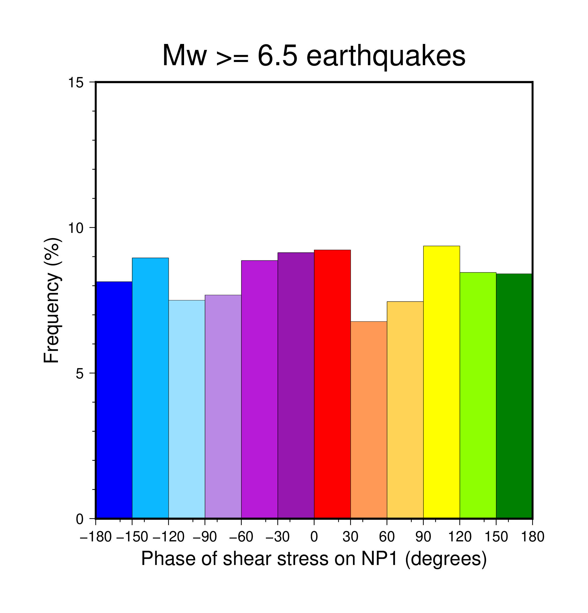

# tidal_gcmt
Tidal parameters for earthquakes in the Global Centroid Moment Tensor catalog

If you use these data, please cite the following data and code references:

Dziewonski, A. M., T.-A. Chou and J. H. Woodhouse, Determination of earthquake source parameters from waveform data for studies of global and regional seismicity, J. Geophys. Res., 86, 2825-2852, 1981. doi:10.1029/JB086iB04p02825

Ekström, G., M. Nettles, and A. M. Dziewonski, The global CMT project 2004-2010: Centroid-moment tensors for 13,017 earthquakes, Phys. Earth Planet. Inter., 200-201, 1-9, 2012. doi:10.1016/j.pepi.2012.04.002

Matsumoto, K., T. Sato, T. Takanezawa, and M. Ooe, 2001, GOTIC2: A program for computation of oceanic tidal loading effect, J. Geod. Soc. Japan, 47, 243-248.

Saito, M., 1988, DISPER80: A subroutine package for the calculation of seismic normal-mode solutions, Seismol. Algorithms, pp. 293-319.

Hirose, F., Maeda, K. and Kamigaichi, O., 2019. Tidal forcing of interplate earthquakes along the Tonga‐Kermadec Trench. Journal of Geophysical Research: Solid Earth, 124(10), pp.10498-10521.

## GCMT Data

GCMT Data were downloaded from https://www.globalcmt.org/CMTfiles.html, as of March 9, 2024. 

Nodal plane 1 is defined as having lower dip than nodal plane 2.

## Tidal Stress and Phase Calculations

Tidal stresses were calculating using TidalStrain.2 (https://www.mri-jma.go.jp/Dep/sei/fhirose/research/en.TidalStrain.html, accessed February 2024) for 24 hours preceding and following each earthquake. Two missing global mesh files were restored prior to calculation, and PREM parameters for deep earthquakes were added to the code. Tidal phase was estimated by quadratic interpolation of surrounding extrema. Tau_p is calcluated following Cochran et al. (2004) as the average of tidal stress at the preceding and trailing maxima.

File format: plain text, space-delimited columns

| column #   |      Field      |  Unit/format |
|----------|:-------------:|------:|
|1|longitude|degrees|
|2|latitude|degrees|
|3|depth|km|
|4|magnitude|Mw|
|5|time|ISO8601|
|6|id|string|
|7|strike (NP1)|degrees|
|8|dip (NP1)|degrees|
|9|rake (NP1)|degrees|
|10|strike (NP2)|degrees|
|11|dip (NP2)|degrees|
|12|rake (NP2)|degrees|
|13|phase of ΔV (NP1)|degrees|
|14|phase of Δt (NP1)|degrees|
|15|phase of Δs (NP1)|degrees|
|16|phase of ΔCFF0.1 (NP1)|degrees|
|17|phase of ΔCFF0.4 (NP1)|degrees|
|18|phase of ΔCFF0.7 (NP1)|degrees|
|19|amplitude of ΔV (NP1)|MPa|
|20|amplitude of Δt (NP1)|MPa|
|21|amplitude of Δs (NP1)|MPa|
|22|amplitude of ΔCFF0.1 (NP1)|MPa|
|23|amplitude of ΔCFF0.4 (NP1)|MPa|
|24|amplitude of ΔCFF0.7 (NP1)|MPa|
|25|phase of ΔV (NP2)|MPa|
|26|phase of Δt (NP2)|MPa|
|27|phase of Δs (NP2)|MPa|
|28|phase of ΔCFF0.1 (NP1)|degrees|
|29|phase of ΔCFF0.4 (NP1)|degrees|
|30|phase of ΔCFF0.7 (NP1)|degrees|
|31|amplitude of ΔV (NP2)|MPa|
|32|amplitude of Δt (NP2)|MPa|
|33|amplitude of Δs (NP2)|MPa|
|34|amplitude of ΔCFF0.1 (NP2)|MPa|
|35|amplitude of ΔCFF0.4 (NP2)|MPa|
|36|amplitude of ΔCFF0.7 (NP2)|MPa|
|37|tau_p of ΔV (NP1)|Mpa|
|38|tau_p of Δt (NP1)|Mpa|
|39|tau_p of Δs (NP1)|Mpa|
|40|tau_p of ΔCFF0.1 (NP1)|Mpa|
|41|tau_p of ΔCFF0.4 (NP1)|Mpa|
|42|tau_p of ΔCFF0.7 (NP1)|Mpa|
|43|tau_p of ΔV (NP2)|Mpa|
|44|tau_p of Δt (NP2)|Mpa|
|45|tau_p of Δs (NP2)|Mpa|
|46|tau_p of ΔCFF0.1 (NP2)|Mpa|
|47|tau_p of ΔCFF0.4 (NP2)|Mpa|
|48|tau_p of ΔCFF0.7 (NP2)|Mpa|

## Example

Using gawk and GMT, plot a histogram of the tidal phase of shear stress for all global earthquakes with magnitude 6.5 or larger, at origin locations:

    gawk < gcmt_origin_data.txt '($4>=6.5){print $14}' | gmt pshistogram -R-180/180/0/15 -JX5i -Z1 -T-180/180/30 -Bxa30f+l"Phase of shear stress on NP1 (degrees)" -Byaf+l"Frequency (%)" -BWStr+t"Mw >= 6.5 earthquakes" -Ctidal_phase.cpt -W0.1p,black > example_hist.ps
    gmt psconvert example_hist.ps -Tg -A+m0.5i

